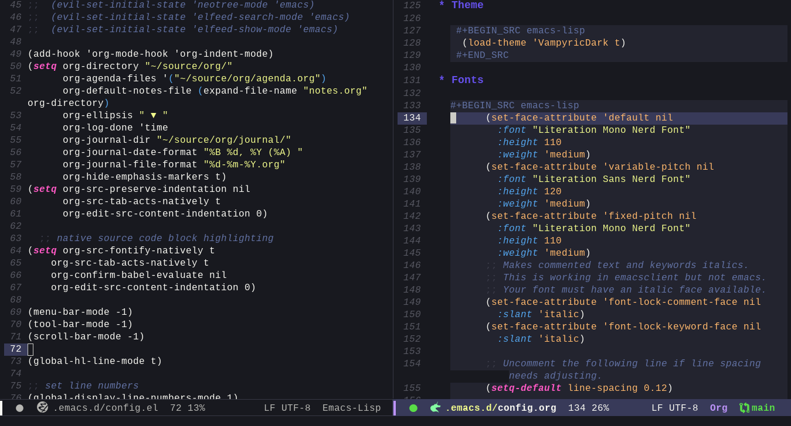

# Vampyric [GNU Emacs](https://www.gnu.org/software/emacs/)

> A dark theme for [GNU Emacs](https://www.gnu.org/software/emacs/).

## Install

Download the theme

`wget https://raw.githubusercontent.com/VampyricDark/emacs/main/vampyricdark-theme.el`

Install the theme (run this inside Emacs)

`M-x package-install path/to/VampyricDark-theme.el`

Load the theme (run this inside Emacs)

`M-x load-theme vampyricdark`

## Team

This theme maintained by:

 |
--- |
[Uiyx](https://github.com/Uiyx) |

## License

Distributed under MIT License. See `LICENSE` for more information.
